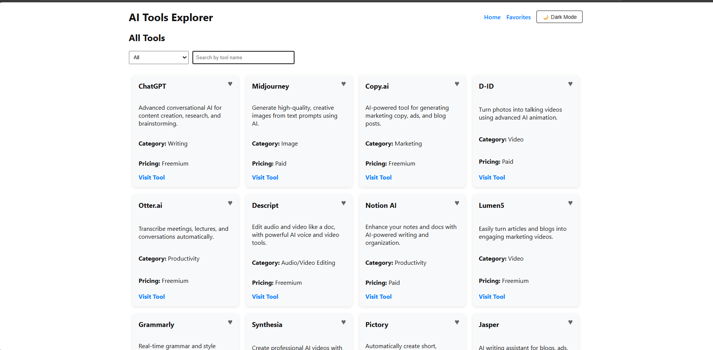
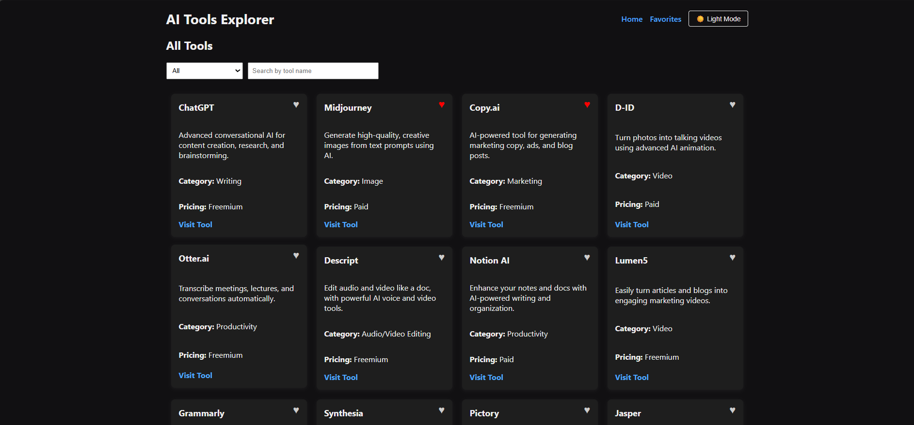

# Simplify AI Tools 🪄

[](https://reactjs.org/)
[](https://axios-http.com/)
[](https://developer.mozilla.org/en-US/docs/Web/JavaScript)
[](https://nodejs.org/)

### 💻 App Interface Preview  
> ☀️ Light Theme 

> 🌙 Dark Theme  


## 🚀 Features

- 🔍 **Search Tools by Name**  
  Quickly find tools by typing keywords in the search bar.

- 🗂️ **Filter by Category**  
  Browse tools based on various predefined categories (e.g., Writing, Image, Marketing, etc.).

- ❤️ **Add/Remove Favorites**  
  Mark tools as favorites with a heart icon, and manage your personal favorites list.

- 🎉 **Confetti Animation on Favorite Add**  
  Celebrate every favorite tool addition with a confetti animation for better user experience.

- 🌐 **Live Tool Preview**  
  Click on tool links to visit and explore their websites directly.

- 🌙/☀️ **Dark and Light Mode Toggle**  
  Switch between dark and light UI themes with a single click.

- ⏳ **Loading Spinners**  
  Smooth user experience with spinners during data fetches or transitions (e.g., category switch, search, favorites).

- 🧠 **Clean Component-Based Architecture**  
  Organized structure using reusable components (e.g., `ToolCard`, `Favorites`, `ToolList`).

## 🚀 How to Run the Project

### 📦 Prerequisites

Ensure you have the following installed on your machine:

- [Node.js](https://nodejs.org/) (v20 or higher)
- [npm](https://www.npmjs.com/) (comes bundled with Node.js)

---

### 🛠️ Setup Instructions

1. **Clone the Repository**

   ```bash
   git clone https://github.com/your-username/your-repo-name.git
   cd your-repo-name

2. **Install Dependencies**

    ```bash
    npm install

3. **Start the React Development Server**
    ```bash
    npm start
4. **🔧 Backend Setup**

    #### 1. Install Dependencies
    ```bash
    npm start
4. **Start the Server**
    ```bash
    npm start

## 📡 API Endpoints

| Method | Endpoint         | Description               |
|--------|------------------|---------------------------|
| GET    | `/tools`         | Fetch all available tools |
| GET    | `/favorites`     | Fetch favorite tools      |
| POST   | `/favorites/:id` | Add a tool to favorites   |
| DELETE | `/favorites/:id` | Remove a tool from favorites |

## 📄 License

This project is for educational and demonstration purposes.
--
 ###Made with ❤️ to simplify your AI tool discovery.
